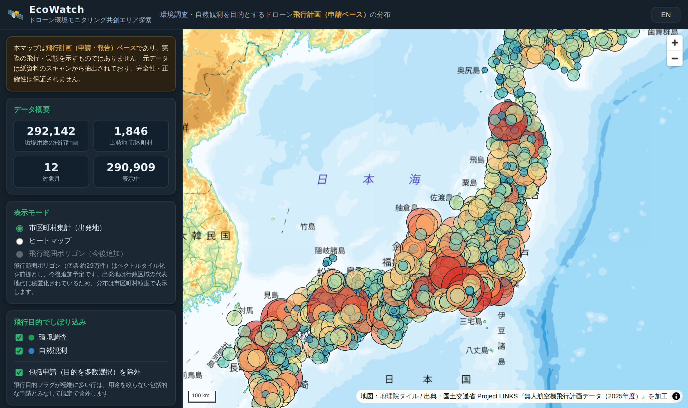

# EcoWatch — ドローン環境モニタリング共創エリア探索

**ドローンの「環境調査・自然観測」目的の飛行計画が、日本のどこで多く申請されているか**を地図で可視化する Web アプリです。環境分野でドローン活用が活発な地域を見つけ、自治体・研究機関・企業の環境部門が連携（共創）できそうなエリアを探すことを目的としています。

🌐 **公開サイト: https://shinyanakashima.github.io/MLIT-LINKS-uav-ecowatch/**



データは国土交通省 Project LINKS が公開する『無人航空機飛行計画データ（2025年度）』（2024年7月〜2025年6月、約297万件）を使用。そのうち飛行目的に「環境調査」または「自然観測」を含む約39万件を抽出し、出発地の市区町村ごとに集計して表示しています。

---

## ⚠️ はじめに：このデータの性質

地図を見る前に、以下を理解してください（サイト上にも常時表示しています）。

- **これは「飛行計画（申請・報告）」であり、実際に飛んだ記録ではありません。** 申請の分布であって、実飛行・実態ではありません。
- **元データは紙資料のスキャンから機械抽出されたもので、完全性・正確性は保証されません。**
- **場所は市区町村単位までしか分かりません。** 出発地は個人特定を避けるため行政区域の代表地点に秘匿化されています。本サイトもそれ以上細かい二次加工は行いません。
- 件数は「申請の件数」です。同一事業者が繰り返し申請すると件数が大きくなります（例：特定の市で件数が突出することがあります）。

## 地図の使い方

| 機能 | 説明 |
|---|---|
| **表示モード** | ①市区町村集計（出発地ごとの件数を円の大小・色で表示）②ヒートマップ（密度を俯瞰） |
| **飛行目的フィルタ** | 「環境調査」「自然観測」の表示切替 |
| **包括申請を除外** | 多数の目的を一括選択した申請（用途を絞らない「包括申請」）の除外切替。既定はオン |
| **対象期間** | 2024年7月〜2025年6月の範囲を月単位で指定 |
| **背景地図・レイヤ** | 地理院タイル（標準／淡色／衛星写真）、自然公園地域、地形陰影の重ね合わせ |
| **言語** | 右上トグルで日本語／English を切替（選択はブラウザに保存） |

円や地域をクリックすると、その市区町村の件数・対象期間などの詳細がポップアップ表示されます。地図の表示位置は URL に保存されるため、特定エリアのビューをそのまま共有できます。

「自然公園地域」レイヤ（緑）を重ねると、環境用途のドローン飛行が**国立・国定・都道府県立の自然公園**とどう重なっているかを視覚的に確認できます。

## データソースと出典

| データ | 提供元 | ライセンス |
|---|---|---|
| 無人航空機飛行計画データ（2025年度） | 国土交通省 [Project LINKS](https://www.mlit.go.jp/links/)（[データセット](https://www.geospatial.jp/ckan/dataset/links-mujinkoukuukihikoukeikaku-2025_)） | 公共データ利用規約（第1.0版）／CC BY 4.0 互換・商用利用可・**出典表記が必要** |
| [自然公園地域データ (A10)](https://nlftp.mlit.go.jp/ksj/gml/datalist/KsjTmplt-A10-v3_1.html) | 国土交通省 国土数値情報 | 同上に準拠 |
| 背景地図タイル | [地理院タイル（国土地理院）](https://maps.gsi.go.jp/development/ichiran.html) | 出典表記により利用可 |

> 出典：国土交通省 Project LINKS『無人航空機飛行計画データ（2025年度）』を加工して作成

## 仕組み（技術概要）

API キー不要の**完全な静的サイト**で、GitHub Pages 単独で動作します。

- フロントエンド：[MapLibre GL JS](https://maplibre.org/)（ライブラリ・フォントを同梱し CDN 非依存）＋地理院タイル。
- データ：約297万件の生データはそのまま配信できないため、事前に Python スクリプトで**環境用途のみを抽出 → 市区町村単位に集計**し、約0.5MBの JSON に軽量化（出発地が市区町村粒度に秘匿化されている性質を利用）。
- 自然公園地域は都道府県別の重い元データを**結合・簡略化して約2MB**のGeoJSONに加工。

### ディレクトリ構成

```
docs/                       GitHub Pages の公開ルート（静的サイト）
  index.html                画面・UI
  css/style.css
  js/app.js                 地図描画・集計・フィルタ
  js/i18n.js                日本語／英語の文言定義
  data/
    summary.json            総件数・月別・目的別などのサマリ
    municipalities.json     出発地（市区町村）別の月×カテゴリ集計
    shizen_koen.geojson     自然公園地域（簡略化した軽量ポリゴン）
  vendor/                   MapLibre GL JS とグリフ（同梱）
scripts/
  extract_env_flights.py    月次GeoJSON（約10GB）をストリーム処理し環境用途を抽出
  build_site_data.py        抽出結果から配信用の軽量JSONを生成
  build_nature_layer.py     国土数値情報A10から自然公園地域の軽量GeoJSONを生成
.github/workflows/
  deploy-pages.yml          main への push で docs/ を Pages へ自動デプロイ
```

## 開発

### ローカルで動かす

```bash
cd docs && python3 -m http.server 8099
# ブラウザで http://127.0.0.1:8099/ を開く
```

### データを再生成する

配信用データ（`docs/data/`）はリポジトリに含まれているため、通常は再生成不要です。元データを更新したい場合のみ実行します。

```bash
pip install ijson openpyxl pyshp shapely

# 1) 飛行計画 全16ファイル（約10GB）をダウンロード→環境用途のみ抽出（逐次ダウンロード・削除）
python3 scripts/extract_env_flights.py data

# 2) 抽出結果から配信用の軽量JSONを生成
python3 scripts/build_site_data.py data/env_flights.json docs/data

# 3) 自然公園地域レイヤ（47都道府県のA10を結合・簡略化）を生成
python3 scripts/build_nature_layer.py docs/data
```

中間生成物の `data/` は `.gitignore` 対象です。配信に必要な `docs/data/*.json` のみをコミットします。

### デプロイ

`main` ブランチの `docs/` 配下を変更して push すると、GitHub Actions が自動で GitHub Pages にデプロイします（Pages の Source は「GitHub Actions」）。

## 参考：抽出データの傾向

走査 2,971,260 件のうち環境用途（環境調査・自然観測）は 387,100 件（うち包括申請 94,958 件）。環境用途の飛行計画は出発地で見ると一部地域に強く集中する傾向があり、共創候補エリアの一次スクリーニングに活用できます。

## 今後の拡張余地

- **自然環境レイヤの拡充**：河川（国土数値情報 W05）・森林地域（A13）・環境省データの追加。
- **飛行範囲ポリゴン**：個票の飛行範囲（約29万件）をベクトルタイル（PMTiles 等）化し、ズーム連動で表示。
- **地域フィルタ**：都道府県・地域での絞り込み UI。
- **空間集計**：飛行範囲と自然環境域の重なり面積の算出（必要なら Cloudflare Workers 等の動的処理）。
